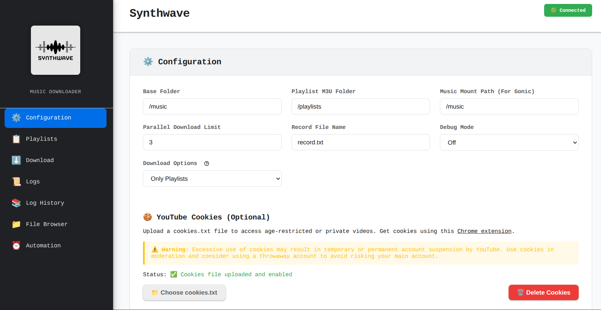
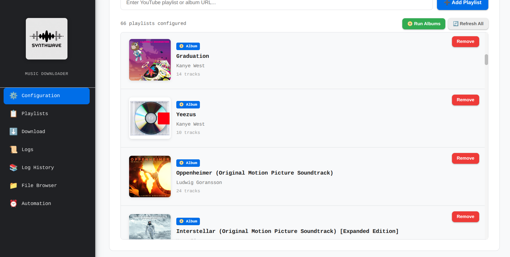
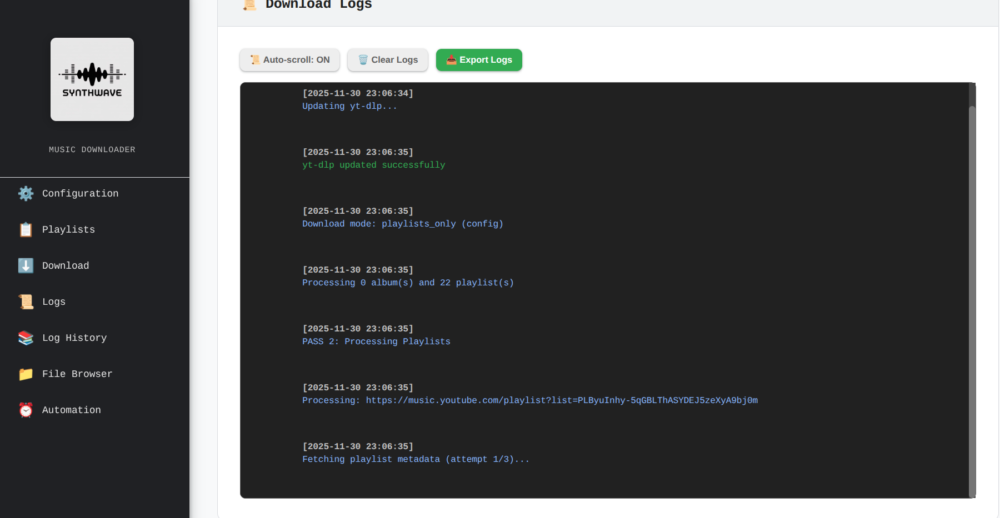
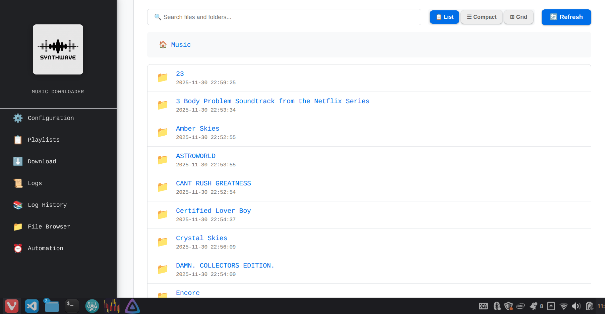
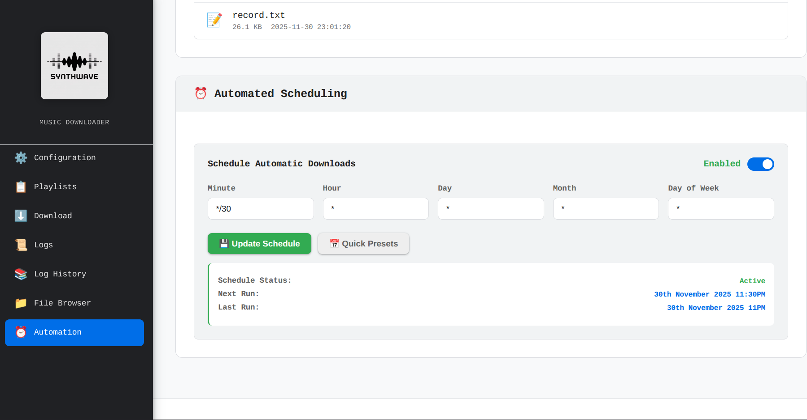

<div align="center">
  
  
  # Synthwave
  
  A self-hosted YouTube Music playlist downloader with a modern web interface, automated scheduling, and Docker support. Download and organize your music playlists with metadata, album artwork, and automatic M3U playlist generation.

  Designed to work around [Gonic](https://github.com/sentriz/gonic) (A Subsonic Compatible Music Streaming Server).
  
  [](LICENSE)
  
  
</div>

---

## 📸 Screenshots

<div align="center">
  
  <p><em>Main Dashboard - Configuration & Download Management</em></p>
  
  
  <p><em>Playlist Management with Preview Cards</em></p>
  
  
  <p><em>Real-time Download Progress & Logs</em></p>
  
  
  <p><em>Integrated File Browser with Audio Playback</em></p>
  
  
  <p><em>Automated Scheduling with Cron Jobs</em></p>
</div>

---

## 🚀 Quick Start

### Using Docker Compose: Production (Recommended)

```bash
git clone https://github.com/PranavVerma-droid/Synthwave.git
cd Synthwave/docker
cp .env.example .env

docker compose up -d
```

Then visit:
```
http://your-server-url:5000
```

### Using Docker Compose: Development Local Test
```bash
git clone https://github.com/PranavVerma-droid/Synthwave.git
cd Synthwave/docker
cp .env.example .env

docker compose -f docker-compose-dev.yml up --build -d
```

Then visit:
```
http://your-server-url:5000
```

### Manual Installation

```bash
# Dependencies
sudo apt-get install nodejs npm ffmpeg imagemagick findutils python3 python3-pip

# Clone the repository
git clone https://github.com/PranavVerma-droid/Synthwave.git
cd Synthwave

# Install dependencies
pip install -r requirements.txt

# Run the application
python app.py
```

## 📋 Usage

1. **Add Playlists**: Paste YouTube playlist or album URLs in the web interface
2. **Configure Settings**: Adjust download paths, timeouts, and retry limits
3. **Start Download**: Click "Start Download" to begin processing
4. **Schedule Downloads**: Enable cron scheduling for automatic updates
5. **Monitor Progress**: Watch real-time progress and logs in the dashboard

### Supported URLs

- YouTube Playlists: `https://www.youtube.com/playlist?list=...`
- YouTube Albums: `https://music.youtube.com/playlist?list=OLAK5uy_...`
- Individual Videos: `https://www.youtube.com/watch?v=...`


## ⚙️ Configuration

The application configuration is stored in `config/config.yaml` and can be edited through the web interface or directly in the file.

### Configuration Options

| Option | Description | Default | Example |
|--------|-------------|---------|---------|
| **BASE_FOLDER** | Root directory where all music files will be downloaded | `/music` | `/data/music` |
| **RECORD_FILE_NAME** | Hidden file that tracks downloaded video IDs to prevent duplicates | `.downloaded_videos.txt` | `.downloaded.txt` |
| **PLAYLIST_M3U_FOLDER** | Directory where M3U playlist files will be generated | `/playlists` | `/data/playlists` |
| **MUSIC_MOUNT_PATH** | Path used in M3U files for media server compatibility (e.g., Gonic) | `/music` | `/music` |
| **PARALLEL_LIMIT** | Maximum number of concurrent downloads (not currently used) | `4` | `3` |
| **TIMEOUT_METADATA** | Timeout in seconds for fetching playlist/song metadata | `600` | `300` |
| **TIMEOUT_DOWNLOAD** | Timeout in seconds for downloading individual songs | `1800` | `900` |
| **MAX_RETRIES** | Number of retry attempts for failed downloads or metadata fetches | `3` | `5` |
| **DEBUG_MODE** | Enable verbose logging for troubleshooting | `false` | `true` |
| **DOWNLOAD_MODE** | Control what content to download: `both` (albums + playlists), `playlists_only` (skip albums), or `albums_only` (skip playlists). Optimizes automated runs by avoiding redundant album scans. | `both` | `playlists_only` |
| **CRON_ENABLED** | Enable scheduled automatic downloads | `false` | `true` |
| **CRON_SCHEDULE** | Cron expression for scheduled downloads | `{"minute": "0", "hour": "2", ...}` | See below |

## Schema
- The Config For this app is created in the `config/config.yaml` file AFTER the first run.
- You can edit the config via the web panel or just by editing the file.

### Technical Working
- The Script will Do Two Passes of your links:
  - Albums: First Pass
  - Playlists: Second Pass
- It will download all albums to the `BASE FOLDER` of the Config, like this:
```
BASE_FOLDER/
      Album 1/
        Artist Name - Song Name - Youtube ID.mp3
```
- It will automatically embed the index, album / song cover, and artist name to the metadata of the file.
- Then, it moves on to playlists, in Pass 2.
- It will then scan the playlists one-by-one. If a song that is already in one of the albums, then it will NOT download it again. It will keep it in its internal queue.
- All songs that are NOT downloaded to any albums will be added to the "Unsorted Songs" album. 
- After it is done downloading all, it will create a `.m3u` file inside the `PLAYLIST_M3U_FOLDER` folder from the Config.
```
PLAYLIST_M3U_FOLDER/
    YOUTUBE_PLAYLIST_ID.m3u
```
- There are also many edge cases that are accounted for, one example:
  - Lets say that there is a song inside the unsorted albums, and before the next run, I added the parent album which it belongs to. It will then MOVE the song from the unsorted album to its album, fix the container metadata, and eventually when it reaches the playlist, update the .m3u.


## 📝 License

MIT License - see [LICENSE](LICENSE) for details.

## 👤 Author

**Pranav Verma**

- GitHub: [@PranavVerma-droid](https://github.com/pranavverma-droid)